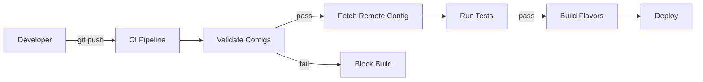

# **PRD: Modular Flutter Wrapper App with Gated Features**

**Doc Owner:**  
 **Version:** 1.0  
 **Last Updated:** October 29, 2025

---

## **1\) Summary**

Build a **Flutter “wrapper” app** that ships a set of **modular features** (modules) which can be **shown/hidden or enabled/disabled** at runtime using **feature flags** and **entitlements**. The goal is to enable rapid creation of custom apps by composing modules, applying brand/theme, and turning features on/off per **environment**, **organization**, **plan (SKU)**, **role**, and **user**—without recompiling the app (within platform policy limits).

---

## **2\) Goals & Non‑Goals**

### **Goals**

* Provide a **shell app** capable of:

  * Discovering and registering **modules** at compile time.

  * **Gating** routes/widgets/buttons via feature flags and entitlements.

  * **White‑label configuration** (name, icons, colors, typography, copy).

  * **Config-driven navigation** (tabs/drawer/stack) based on enabled modules.

  * **Analytics & logging** instrumentation with consistent event schema.

  * **Multi-tenancy** support (org-level config).

  * **Remote config** with local fallback for offline/first run.

* Enable **rapid customization** to produce client-specific apps by (a) providing a config file, (b) toggling features, (c) swapping visuals.

### **Non‑Goals**

* **Dynamic code push** or downloading executable code/plugins at runtime (disallowed on iOS and out of scope).

* Full CMS or headless backend design—this PRD defines minimum API contracts for flags/entitlements/config.

---

## **3\) Target Users / Personas**

* **Org Admin**: Manages users, roles, and purchased features (plans). Needs admin screens.

* **Member/Employee**: Uses app modules (e.g., dashboard, forms, chat).

* **Guest**: Minimal access; sees login/onboarding only.

* **App Ops**: Manages build pipeline, feature flags, and crash/analytics dashboards.

* **Admin Dashboard User**: Manages feature flags and gated features through the **Admin Dashboard** (see Section 9.5).

---

## **4\) Success Metrics**

* **TTV (Time-to-Variant)**: \< 1 day to ship a new white‑label with existing modules.

* **No‑code config coverage**: ≥ 90% of branding and navigation driven by config.

* **Runtime gating latency**: feature check ≤ 10ms (cached).

* **Crash-free sessions**: ≥ 99.8%.

* **Cold start** (release build mid-range device): ≤ 2.2s.

* **App size impact per module**: ≤ 2.5 MB (Android AAB split; iOS measured uncompressed).

---

## **5\) Release Scope (MVP)**

* Shell app \+ module registry

* Modules (MVP set):

  * **Auth** (email/OIDC)

  * **Home** (cards, announcements)

  * **Content** (list/detail)

  * **Forms** (simple data capture)

  * **Support/Chat** (stub with provider abstraction)

  * **Settings** (profile, org switch, theme toggle)

* Gating:

  * **Feature flags** (kill switches, rollout, visibility)

  * **Entitlements** (plan/role/user)

* Config:

  * App/theme/branding

  * Navigation layout (tabs or drawer)

  * Module enablement per environment

* Analytics: screen view \+ action events

* Error handling \+ offline cache of config & flags

* CI/CD with flavors (dev, staging, prod)

---

## **6\) Architecture Overview**

* **Flutter** (stable channel), **Dart** null-safety.

* **State mgmt**: **Riverpod** (or Provider; choose one—default Riverpod).

* **Navigation**: `go_router` with guarded routes.

* **HTTP**: `dio` (retry \+ interceptors).

* **Storage**: `shared_preferences` (light), `hive` or `sqflite` (cache).

* **Remote Config**: pluggable provider (e.g., Firebase Remote Config or custom `/config` API).

* **Analytics**: pluggable (Firebase Analytics/Segment/Amplitude).

* **Theming**: token-based (light/dark), passed via `ThemeData`.

* **Modularity**: each module is a **Dart package** under `/packages`, registered via a **ModuleRegistry** at app start.

* **Gating**: central **FeatureGate** service evaluating (flags ⟶ entitlements ⟶ local fallbacks).

---

## **7\) Project Structure**

`apps/`  
  `wrapper_app/`  
    `lib/`  
      `main.dart`  
      `app_shell.dart`  
      `di_container.dart`  
      `router.dart`  
      `feature_gate.dart`  
      `module_registry.dart`  
      `theme_loader.dart`  
      `analytics.dart`  
      `config_loader.dart`  
    `assets/`  
      `config/`  
        `app_config.dev.json`  
        `app_config.stg.json`  
        `app_config.prod.json`  
      `themes/`  
        `default_theme.json`  
    `android/...`  
    `ios/...`  
`packages/`  
  `core/                   # shared types, guards, UI kit, network`  
  `module_auth/`  
  `module_home/`  
  `module_content/`  
  `module_forms/`  
  `module_support/`  
  `module_settings/`  
  `module_sdk/             # Module interface + annotations`

---

## **8\) Module SDK Contract**

**Goal:** Define a consistent way for modules to declare their metadata, routes, and gates.

`// packages/module_sdk/lib/module_descriptor.dart`  
`abstract class ModuleDescriptor {`  
  `String get id;               // e.g., "auth", "home"`  
  `String get version;          // semver`  
  `String get displayName;      // for UI`  
  `List<RouteDefinition> get routes;  // guarded routes`  
  `List<MenuEntry> get navigation;    // tab/drawer items`  
  `List<FeatureKey> get requiredFeatures; // module-level gates`  
  `Future<void> initialize(ModuleContext ctx);`  
`}`

`class RouteDefinition {`  
  `final String route;          // e.g., "/forms"`  
  `final WidgetBuilder builder;`  
  `final List<FeatureKey> gates; // features required to access this route`  
  `const RouteDefinition({required this.route, required this.builder, this.gates = const []});`  
`}`

`typedef FeatureKey = String;   // e.g., "forms.submit", "chat.view"`

`class MenuEntry {`  
  `final String label;`  
  `final String route;`  
  `final String iconName;       // maps to Material icon`  
  `final List<FeatureKey> gates;`   
  `const MenuEntry({required this.label, required this.route, required this.iconName, this.gates = const []});`  
`}`

`class ModuleContext {`  
  `final Reader read;            // Riverpod`  
  `final FeatureGate gate;       // feature checks`  
  `final Analytics analytics;    // event dispatch`  
  `// add: localization, theme tokens, etc.`  
`}`

**Registration:**

`// apps/wrapper_app/lib/module_registry.dart`  
`final List<ModuleDescriptor> kModules = [`  
  `AuthModule(),`  
  `HomeModule(),`  
  `ContentModule(),`  
  `FormsModule(),`  
  `SupportModule(),`  
  `SettingsModule(),`  
`];`

Modules are **compiled into the binary**. Gating controls visibility and access—no dynamic code download.

---

## **9\) Feature Gating Model**

### **9.1 Definitions**

* **Feature Flag (FF):** Boolean/variant allowing kill switch, staged rollout, or UI visibility.

* **Entitlement:** Permission to use a capability based on **plan**, **role**, **org**, **user**.

* **Required Feature Key:** String key associated to a route/widget.

### **9.2 Evaluation Order (highest precedence first)**

1. **Emergency kill switch** (FF \= off) → deny.

2. **User override** (allow/deny) → apply.

3. **Role-based entitlement** → allow/deny.

4. **Plan/SKU entitlement** → allow/deny.

5. **Org default** → allow/deny.

6. **Feature flag default & local fallback** → allow/deny.

### **9.3 Data Sources**

* **Remote Config**: `/feature-flags` (keys \+ values, rollout rules).

* **Admin Dashboard**: Web-based interface for managing feature flags (see Section 9.5).

* **Entitlements API**: `/me/entitlements` (scoped to org).

* **Local Cache**: persisted snapshot (TTL configurable).

### **9.4 Guarding APIs (Dart)**

`abstract class FeatureGate {`  
  `bool can(String featureKey);                   // synchronous cached check`  
  `Stream<void> get onChanged;                    // notify to rebuild UI`  
`}`

`class Guarded extends StatelessWidget {`  
  `final String featureKey;`  
  `final Widget child;`  
  `final Widget? fallback; // e.g., upsell or 404`  
  `// build shows child if gate.can(featureKey) else fallback`  
`}`

`GoRoute guardedRoute(String path, WidgetBuilder builder, List<String> gates) {`  
  `return GoRoute(`  
    `path: path,`  
    `redirect: (ctx, state) {`  
      `final gate = ctx.read(featureGateProvider);`  
      `final ok = gates.every(gate.can);`  
      `return ok ? null : "/not-authorized";`  
    `},`  
    `builder: (_, __) => builder(_),`  
  `);`  
`}`

### **9.5 Admin Dashboard Workflow**

Feature flags are **managed through an Admin Dashboard** and **baked into the app at build time**:

**Admin Dashboard Deployment Options:**

| Mode | Description | Use Case |
|------|-------------|-----------|
| **Cloud-hosted** | SaaS dashboard with multi-tenant isolation | Production scale, multiple clients |
| **Self-hosted** | Deployed in customer's infrastructure | Enterprise with data residency requirements |
| **Offline/JSON** | Direct file-based config editing | Development, air-gapped environments |

**Authentication Methods:**
- OAuth 2.0 / OIDC for user login
- API Keys for CI/CD automation
- Service Account JWTs for cross-service auth

### **9.6 Feature Flag Diff Tool**

**Purpose:** Compare feature flag configurations between environments to catch drift and ensure consistency.

**CLI Usage:**
```bash
# Compare dev vs prod
python -m automation.diff --env1 dev --env2 prod

# Compare with verbose output
python -m automation.diff --env1 stg --env2 prod --verbose

# Export diff to file
python -m automation.diff --env1 dev --env2 prod --output diff_report.json
```

**Diff Output Format:**
```json
{
  "compared_at": "2025-11-15T10:00:00Z",
  "environment_1": "dev",
  "environment_2": "prod",
  "summary": {
    "added_in_env2": ["forms.advanced"],
    "removed_in_env2": ["debug.gates"],
    "modified": ["chat.view"],
    "same": ["forms.submit"]
  },
  "details": [
    {
      "key": "chat.view",
      "env1_value": true,
      "env2_value": false,
      "env1_rules": [],
      "env2_rules": [{"if": {"plan": "pro"}, "value": true}]
    }
  ]
}
```

**CI/CD Integration:**
```yaml
- name: Check Feature Flag Drift
  run: |
    python -m automation.diff \
      --env1 stg --env2 prod \
      --fail-on-drift \
      --allowed-drift-keys debug.*,beta.*
```

### **9.7 Rollout Strategies**

**Supported Rollout Patterns:**

| Strategy | Description | Configuration |
|----------|-------------|---------------|
 | **Percentage** | Gradual rollout by user % | `{"percent": 10}` |
| **Canary** | Release to specific orgs/users first | `{"orgId": ["org_beta"]}` |
| **Time-based** | Scheduled activation | `{"after": "2025-12-01T00:00:00Z"}` |
| **User Segment** | Target by attributes | `{"role": "admin", "plan": "enterprise"}` |

**Example Multi-Stage Rollout:**
```json
{
  "key": "new_dashboard",
  "value": false,
  "rules": [
    {"if": {"role": "internal"}, "value": true},
    {"if": {"orgId": "pilot_corp"}, "value": true},
    {"if": {"percent": 5}, "value": true},
    {"if": {"after": "2025-12-01"}, "value": true}
  ]
}
```

**1. Admin Dashboard (Web Interface)**

* **Purpose**: Enable/disable features for specific environments, organizations, plans, or users
* **Audience**: Product managers, customer success, engineering leads
* **Actions Available**:
  * Toggle feature flags (on/off, percentage rollout)
  * Define rollout rules (by org, plan, role, user)
  * View feature usage metrics
  * Schedule feature launches

**2. Build-Time Config Fetch**

During CI/CD pipeline execution, the automation system fetches the latest feature configuration from the Admin Dashboard API:

```yaml
# CI Pipeline Stage: fetch-config
- name: Fetch Feature Configuration
  run: |
    python -m automation.config_fetcher \
      --env ${FLAVOR} \
      --api ${ADMIN_API_URL} \
      --api-key ${ADMIN_API_KEY} \
      --output apps/wrapper_app/assets/config/
```

This creates environment-specific config files embedded in the app binary.

**3. Runtime Flow**

```
Admin Dashboard (Web)  →  Config API  →  Build Pipeline  →  App Binary
     (write)                (read)         (embed)         (baked-in)
```

* **At Runtime**: App reads baked-in config first, then may fetch updates (if enabled)
* **Offline**: Baked-in config guarantees app works without network
* **Updates**: Remote config can override baked-in values for gradual rollout

**Example Admin Dashboard Config Export:**

`{`
 `"environment": "prod",`
 `"exportedAt": "2025-11-15T10:00:00Z",`
 `"features": [`
 `{ "key": "chat.view", "value": true, "rules": [...] },`
 `{ "key": "forms.advanced", "value": false, "rules": [...] }`
 `],`
 `"signature": "sha256:abc123..."  # integrity check`
`}`

---

## **10\) Navigation**

Config-driven **tabs** or **drawer**:

* **Tabs**: up to 5 primary entries; overflow routes accessible via “More”.

* **Drawer**: unlimited sections; shows only entries passing gate checks.

* Modules contribute **MenuEntry** objects; the shell **filters** by gate and assembles the nav.

---

## **11\) Configuration**

### **11.1 App Config (per environment)**

`{`  
  `"app_id": "com.company.wrapper",`  
  `"app_name": "Wrapper App",`  
  `"env": "prod",`  
  `"api_base_url": "https://api.example.com",`  
  `"remote_config_url": "https://api.example.com/config",`  
  `"navigation": {`  
    `"layout": "tabs",`   
    `"order": ["home", "content", "forms", "support", "settings"]`  
  `},`  
  `"modules": {`  
    `"auth": { "enabled": true },`  
    `"home": { "enabled": true },`  
    `"content": { "enabled": true },`  
    `"forms": { "enabled": true },`  
    `"support": { "enabled": false },`  
    `"settings": { "enabled": true }`  
  `},`  
  `"features": {`  
    `"forms.submit": { "default": true },`  
    `"chat.view": { "default": false },`  
    `"chat.reply": { "default": false }`  
  `},`  
  `"theme": "default_theme.json"`  
`}`

### **11.2 Theme Tokens (JSON)**

`{`  
  `"brand": {`  
    `"primary": "#2B6CB0",`  
    `"secondary": "#2C5282",`  
    `"accent": "#ED8936"`  
  `},`  
  `"typography": {`  
    `"fontFamily": "Inter",`  
    `"scale": { "baseSize": 14 }`  
  `},`  
  `"shapes": { "radius": 10 },`  
  `"darkMode": { "enabled": true, "primary": "#90CAF9" }`  
`}`

---

## **12\) Data Model (Key Types)**

`// FeatureFlag`  
`{`  
  `"key": "chat.view",`  
  `"type": "boolean",`  
  `"value": true,`  
  `"rules": [`  
    `{ "if": { "orgId": "org_123" }, "value": false },`  
    `{ "if": { "percent": 10 }, "value": true } // rollout`  
  `],`  
  `"updatedAt": "2025-10-01T12:00:00Z"`  
`}`

`// Entitlement`  
`{`  
  `"userId": "u_1",`  
  `"orgId": "org_123",`  
  `"plan": "pro",`  
  `"roles": ["admin", "member"],`  
  `"features": {`  
    `"chat.view": "allow",`  
    `"chat.reply": "deny"`  
  `}`  
`}`

`// ModuleDescriptor manifest (derived)`  
`{`  
  `"id": "forms",`  
  `"version": "1.2.0",`  
  `"routes": ["/forms", "/forms/new"],`  
  `"featureKeys": ["forms.view", "forms.submit"]`  
`}`

---

## **13\) Minimal API Contracts (Example)**

* `POST /auth/login` → `{ token, user, orgs }`

* `GET /users/me` → `{ id, email, name, orgs[], roles[] }`

* `GET /orgs/:id/entitlements` → `{ plan, roles[], features{key: allow|deny} }`

* `GET /feature-flags` → `{ flags[] }`

* `GET /config` → `{ navigation, modules, features, theme }`

* `GET /content` → list

* `POST /forms/:id/submit` → `{ status }`

All responses include `etag`/`last-modified` for caching. Auth via **OIDC bearer JWT**.

---

## **14\) Security & Privacy**

* **Auth**: OIDC/OAuth2, PKCE; refresh tokens stored in **secure storage**.

* **JWT** validation in app (exp, iss, aud) \+ server-side authorization.

* **PII**: minimize; encrypt at rest in local DB (if used).

* **Logs**: scrub emails/ids; no secrets.

* **Network**: TLS 1.2+; pinning optional via `dio` if required.

* **Screenshots**: allow unless marked sensitive screens (flag).

---

## **15\) Offline & Caching**

* Cache: config, flags, entitlements, last success responses (TTL 1 hour default).

* Offline behavior:

  * **Flags/Entitlements unavailable**: use last snapshot; if none, hide gated features by default and show upsell/placeholder.

  * **Forms**: queue submissions with retry backoff.

* Show **offline banner** with retry action.

---

## **16\) Analytics & Telemetry**

* **Common event schema**: `app_id`, `org_id`, `user_id`, `screen`, `route`, `feature_key`, `result`, `duration_ms`.

* **Key events**:

  * `screen_view`

  * `feature_gate_check` (include key \+ verdict)

  * `cta_tap` (`id`, `label`, `feature_key`)

  * `form_submit` (`form_id`, `result`)

  * `error_show` (`code`, `message_hash`)

* Respect **opt-in** and regional privacy laws; disable tracking per config.

---

## **17\) Accessibility & Localization**

* **A11y**: semantic labels, minimum tap size 48dp, dynamic type, contrast ≥ 4.5:1.

* **Localization**: ARB files per module; shell provides `intl` setup; fallback to English.

---

## **18\) Performance Budgets**

* First meaningful paint ≤ 1.5s (warm) / 2.2s (cold).

* Route change ≤ 300ms.

* Memory footprint target ≤ 150MB on mid device while idle.

* Jank \< 1% frames over 16ms (60Hz).

---

## **19\) Error Handling UX**

* **Guard failures**: show `Not Authorized` screen with reason \+ upsell CTA if configured.

* **Network**: show contextual retry; exponential backoff (100ms → 10s).

* **Global error boundary**: capture and route to crash reporter.

* **Module init failure**: soft-disable module, log event, show degraded nav.

---

## **20\) Build, Flavors, CI/CD**

* Flavors: `dev`, `stg`, `prod` with matching config assets.

* **CI**:

  * Lint \+ `flutter analyze` \+ `flutter test --coverage`.

  * Build AAB (Android) & IPA (iOS) with fastlane.

  * Artifact names include git SHA \+ flavor.

* **Config signing**: `remote_config_url` is environment-specific.

### **20.2 Remote Config Synchronization**

**Runtime Config Sync:**

The app periodically fetches fresh configuration from the remote API to enable gradual rollouts and emergency feature toggles without app store updates.

**Sync Strategy:**

| Aspect | Behavior |
|--------|----------|
| **Initial Load** | Use baked-in config for instant startup |
| **Background Sync** | Fetch after splash screen, every 15 min |
| **Pull-to-Refresh** | Manual trigger in Settings > Debug |
| **Update Handling** | Apply non-breaking changes immediately; prompt for restart if navigation structure changes |

**Conflict Resolution:**
```dart
enum ConfigSource { bakedIn, cached, remote }

class ConfigPriority {
  // Remote > Cache > BakedIn (with freshness check)
  static Config select(List<Config> configs) {
    // Prefer remote if fetched within last hour
    // Fallback to cache if remote failed
    // Fallback to baked-in if nothing else available
  }
}
```

**Payload Optimization:**
- ETag-based conditional requests (304 Not Modified)
- Delta updates (only changed keys) for subsequent fetches
- Brotli compression for reduced bandwidth
- Config size target: < 50KB gzipped

---

## **21\) Testing & QA**

### **21.1 Unit**

* FeatureGate evaluation (all precedence combinations).

* Config loader \+ theme parser.

* Route guards.

### **21.2 Widget**

* Guarded widgets (visible/hidden with mocks).

* Navigation builds filtered by gates.

### **21.3 Integration**

* Login flow (OIDC mocked).

* Offline-first startup with cached config.

* Form submit retry.

### **21.4 Golden Tests**

* Themed screens (light/dark).

### **21.5 Acceptance Criteria (MVP)**

* Shell reads env config and boots with theme & nav.

* Modules register and appear only when enabled & permitted.

* Guarded routes block access and redirect with message.

* Remote flag flips update UI **without restart**.

* Offline startup works with last known config.

* Analytics events fire for key actions.

* A11y checks pass baseline.

### **21.6 Entitlements Simulator**

**Purpose:** Local tool for developers and QA to simulate different user/org/plan combinations without modifying backend data.

**Features:**
* **Persona Presets:** Quick switch between common user types:
  - Free plan user
  - Pro plan admin
  - Enterprise member
  - Guest/unauthenticated
* **Custom Simulation:** Configure any combination of:
  - Plan tier (free/pro/enterprise)
  - Roles (admin/member/viewer)
  - Organization ID
  - Entitlements overrides
* **Effective Permissions View:** See all resolved feature permissions for current simulation

**CLI Usage:**
```bash
# List available personas
python -m automation.simulate --list-personas

# Simulate specific persona
python -m automation.simulate --persona pro_admin

# Custom simulation
python -m automation.simulate \
  --plan enterprise \
  --roles admin,member \
  --org-id org_test_123 \
  --entitlements chat.view:true,forms.advanced:true

# Export simulation config for sharing
python -m automation.simulate --persona beta_user --export > ~/.config/wrapper_app/simulation.json
```

**Flutter Integration:**
```dart
// In dev builds only
if (kDebugMode) {
  SimulationOverlay(
    child: MyApp(),
    presets: [
      SimulationPreset.freeUser,
      SimulationPreset.proAdmin,
      SimulationPreset.enterpriseMember,
    ],
  );
}
```

**Effective Gates Debug Screen:**
A developer-only screen showing:
- Current simulation context (plan, role, org)
- All feature flags with their resolved values
- Reason for each decision (flag vs entitlement vs default)
- Override toggles for testing edge cases

---

## **22\) Risks & Mitigations**

* **Platform policy** (no dynamic code load): compile all modules; use gating for exposure.

* **Flag misconfigurations**: add preview banner & “effective gates” debug screen.

* **Cold start time**: lazy-init modules; defer network calls; splash cache.

* **Theme conflicts**: limit token surface; lint for missing tokens.

* **Multi-tenant complexity**: enforce org scoping in every request; clear caches on org switch.

---

## **23\) Open Questions (Default Choices if Unanswered)**

1. **Remote Config provider?** Default to REST `/config` \+ ETag (can swap to Firebase RC).

2. **Analytics vendor?** Default to Firebase with abstraction to swap.

3. **Chat provider?** Default to abstraction (no-op) with interface `ChatService`.

4. **Payments/subscriptions?** Out of MVP; if needed, add IAP/Stripe server entitlements.

---

## **24\) UX Outline (MVP)**

* **Launch** → Splash (loads config/flags) →

  * If **unauth**: Auth module (Login, Org chooser\*)

  * If **auth**: Home tab (cards; announcements)

* **Tabs**: Home | Content | Forms | (Support\*) | Settings

* **Settings**: Profile, Org switch, Theme, Legal

* **Guarded surfaces**: Support tab (chat.view), Forms Submit (forms.submit)

\* Only visible if gate passes.

---

## **25\) Example Configs**

### **25.1 Feature Flags (server payload)**

`{`  
  `"flags": [`  
    `{ "key": "chat.view", "value": true, "rules": [{ "if": {"orgId": "org_beta"}, "value": false }] },`  
    `{ "key": "chat.reply", "value": false, "rules": [{ "if": {"role": "admin"}, "value": true }] },`  
    `{ "key": "forms.submit", "value": true }`  
  `],`  
  `"updatedAt": "2025-10-29T10:00:00Z"`  
`}`

### **25.2 Entitlements (per user/org)**

`{`  
  `"userId": "u_42",`  
  `"orgId": "org_alpha",`  
  `"plan": "pro",`  
  `"roles": ["member"],`  
  `"features": {`  
    `"chat.view": "allow",`  
    `"chat.reply": "deny",`  
    `"forms.submit": "allow"`  
  `}`  
`}`

---

## **26\) Sample Code Snippets**

### **26.1 Route Guard**

`final router = GoRouter(`  
  `routes: [`  
    `GoRoute(path: '/', builder: (_, __) => const ShellScreen()),`  
    `// Module-provided:`  
    `...kModules.expand((m) => m.routes.map((r) => guardedRoute(r.route, r.builder, r.gates)))`  
  `],`  
`);`

### **26.2 Guarded Widget Usage**

`Guarded(`  
  `featureKey: "forms.submit",`  
  `child: ElevatedButton(`  
    `onPressed: () => ctx.read(formsController).submit(),`  
    `child: const Text("Submit"),`  
  `),`  
  `fallback: TextButton(onPressed: () => _showUpsell(), child: const Text("Upgrade plan")),`  
`)`

### **26.3 Theme Loader (tokens → ThemeData)**

`Future<ThemeData> loadThemeTokens(String path) async {`  
  `final jsonStr = await rootBundle.loadString('assets/themes/$path');`  
  `final map = json.decode(jsonStr);`  
  `final primary = _parseColor(map["brand"]["primary"]);`  
  `return ThemeData(`  
    `colorScheme: ColorScheme.fromSeed(seedColor: primary),`  
    `useMaterial3: true,`  
  `);`  
`}`

---

## **27\) Module Specs (MVP)**

### **27.1 Auth Module**

* **Screens**: Login, Register (optional), Org Picker.

* **APIs**: `/auth/login`, `/users/me`.

* **Gates**: none (always enabled when module enabled).

* **Events**: `auth_login_success`, `auth_login_failure`.

### **27.2 Home Module**

* **Screens**: Home dashboard (cards).

* **Gates**: `"home.view"` (default allow).

* **Events**: `home_card_tap`.

### **27.3 Content Module**

* **Screens**: List, Detail.

* **Gates**: `"content.view"`.

* **APIs**: `/content`.

* **Events**: `content_open`.

### **27.4 Forms Module**

* **Screens**: Forms list, Form detail, Submit.

* **Gates**: `"forms.view"`, `"forms.submit"`.

* **APIs**: `/forms/:id/submit`.

* **Offline**: queue submissions.

* **Events**: `form_submit`.

### **27.5 Support/Chat Module**

* **Screens**: Thread list, Thread detail.

* **Gates**: `"chat.view"`, `"chat.reply"`.

* **Provider**: `ChatService` interface (no-op default).

* **Events**: `chat_message_send`.

### **27.6 Settings Module**

* **Screens**: Profile, Org switch, Theme, Legal, Debug gates (dev only).

* **Gates**: `"settings.view"`.

* **Events**: `settings_change_theme`.

---

## **28\) White‑Labeling**

* App **name**, **icons**, **splash**, **theme tokens**, and **strings** loaded from config \+ assets.

* Branding pack per client: `assets/brands/<client_id>/...` with symlink or build-time copy.

* Build flavor picks brand pack \+ env config.

---

## **29\) Developer Experience**

### **29.1 Module Scaffolding CLI**

**Purpose:** Generate new modules following the PRD specification with boilerplate, tests, and documentation.

**CLI Usage:**
```bash
# Create new module with basic structure
python -m automation.create-module --name module_blog

# Create module with specific routes
python -m automation.create-module \
  --name module_analytics \
  --routes "/analytics,/analytics/dashboard,/analytics/reports/:id" \
  --gates "analytics.view,analytics.export"

# Create module from template
python -m automation.create-module \
  --name module_polls \
  --template form-module
```

**Generated Structure:**
```
packages/module_blog/
├── lib/
│   ├── module_blog.dart              # Public API
│   ├── src/
│   │   ├── blog_module.dart          # ModuleDescriptor impl
│   │   ├── screens/
│   │   │   ├── blog_list_screen.dart
│   │   │   └── blog_detail_screen.dart
│   │   ├── widgets/
│   │   │   └── blog_card.dart
│   │   └── services/
│   │       └── blog_service.dart
│   └── l10n/
│       └── app_en.arb
├── test/
│   ├── blog_module_test.dart
│   ├── screens/
│   │   └── blog_list_screen_test.dart
│   └── goldens/
│       └── blog_list_screen.png
├── README.md                         # Module documentation
├── pubspec.yaml
└── module_config.json                # Module metadata
```

**Module Template Options:**

| Template | Description | Includes |
|----------|-------------|----------|
| `minimal` | Basic module shell | ModuleDescriptor, empty routes |
| `list-detail` | CRUD pattern | List + Detail + Form screens |
| `form-module` | Data capture | Form with validation, offline queue |
| `content-module` | Display focused | Rich text, media, offline cache |
| `integration` | External service | Service abstraction + provider |

**Generated Code Example (module_blog.dart):**
```dart
import 'package:module_sdk/module_sdk.dart';

/// Blog module for the wrapper app.
/// 
/// Generated by: automation.create-module
/// Version: 1.0.0
class BlogModule extends ModuleDescriptor {
  @override
  String get id => 'blog';

  @override
  String get version => '1.0.0';

  @override
  String get displayName => 'Blog';

  @override
  List<FeatureKey> get requiredFeatures => ['blog.view'];

  @override
  List<RouteDefinition> get routes => [
    RouteDefinition(
      route: '/blog',
      builder: (_) => const BlogListScreen(),
      gates: ['blog.view'],
    ),
    RouteDefinition(
      route: '/blog/:id',
      builder: (_) => const BlogDetailScreen(),
      gates: ['blog.view'],
    ),
  ];

  @override
  List<MenuEntry> get navigation => [
    MenuEntry(
      label: 'Blog',
      route: '/blog',
      iconName: 'article',
      gates: ['blog.view'],
    ),
  ];

  @override
  Future<void> initialize(ModuleContext ctx) async {
    // Module initialization
    ctx.analytics.track('blog_module_initialized');
  }
}
```

### **29.2 Debug Screen & Developer Tools**

**Effective Gates Debug Screen:**

Accessible via Settings > Developer (dev builds only) or shake gesture:

```
┌─────────────────────────────────────────┐
│  Debug Panel - Effective Gates          │
├─────────────────────────────────────────┤
│  Simulation: ┌───────────┐              │
│             │ Pro Admin ▼│             │
│             └───────────┘              │
├─────────────────────────────────────────┤
│  Context:                               │
│  • Plan: pro                            │
│  • Role: admin                          │
│  • Org: org_test_abc                    │
├─────────────────────────────────────────┤
│  Feature Flags:                         │
│  ☑ chat.view       ✓ allow (flag)       │
│  ☑ chat.reply      ✗ deny (role)        │
│  ☑ forms.submit    ✓ allow (plan)       │
│  ☐ forms.advanced  ✗ deny (flag)        │
├─────────────────────────────────────────┤
│  [Export Config] [Load Config] [Reset]  │
└─────────────────────────────────────────┘
```

**Available Developer Tools:**

| Tool | Purpose | Access |
|------|---------|--------|
| **Gate Explorer** | Browse all feature flags and their resolved values | Shake → Gates |
| **Config Inspector** | View raw config JSON, diff vs baked-in | Debug menu |
| **Network Logger** | HTTP request/response inspection | Shake → Network |
| **Performance Overlay**| CPU/memory profiling | Shake → Perf |
| **Route Debugger** | Navigate to any route directly | Shake → Routes |
| **Theme Previewer** | Live theme token editing | Debug menu |

**Local Overrides (Dev Only):**
```dart
// Toggle features locally for testing
FeatureGate.override('forms.advanced', true);

// Reset all overrides
FeatureGate.clearOverrides();

// Persist overrides across app restarts (dev only)
FeatureGate.persistOverrides(true);
```

### **29.3 CLI Commands Reference**

```bash
# Pipeline
python -m automation.cli pipeline --flavors dev stg prod
python -m automation.cli pipeline --execute

# Config
python -m automation.cli config --env dev --api $API_URL
python -m automation.config_fetcher --env prod --output ./config

# Validation
python -m automation.validate --config app_config.dev.json
python -m automation.validate --all-environments --strict

# Diff
python -m automation.diff --env1 dev --env2 prod
python -m automation.diff --env1 stg --env2 prod --fail-on-drift

# Simulation
python -m automation.simulate --persona pro_admin
python -m automation.simulate --plan enterprise --roles admin

# Module Scaffolding
python -m automation.create-module --name module_chat
python -m automation.create-module --name module_events --template list-detail

# Mock Server
python -m automation.mock_admin_server --port 8765 --verbose
```

---

## **30\) Automation Tooling Summary**

The automation package provides a complete toolchain for managing the wrapper app lifecycle:

| Tool | File | Purpose | When to Use |
|------|------|---------|-------------|
| **Pipeline Planner** | `pipeline.py` | CI/CD stage orchestration | Build automation |
| **Config Fetcher** | `config_fetcher.py` | Fetch feature flags from Admin Dashboard | Build time |
| **Config Validator** | `validator.py` | Schema validation & linting | Pre-commit, CI |
| **Diff Tool** | `diff.py` | Compare env configs | Deployment checks |
| **Simulator** | `simulate.py` | Test user personas | Development, QA |
| **Module Scaffolder** | `create_module.py` | Generate new modules | Feature development |
| **Mock Server** | `mock_admin_server.py` | Local API testing | Development, CI |
| **CLI** | `cli.py` | Unified command interface | Daily workflows |

**Workflow Integration:**



---

## **31\) Definition of Done (MVP)

* Builds & runs on iOS 15+ and Android 8+ (API 26).

* All MVP modules compiled & registered.

* Feature flags and entitlements shape access consistently across routes \+ widgets.

* Config-only nav \+ theme works.

* Offline startup & cached flags functional.

* CI pipeline produces signed artifacts per flavor.

* QA checklist passed (unit, widget, integration, goldens).

* Minimal technical documentation (README \+ module guide).

---

## **32\) How to Add a New Module (Playbook)**

### **Quick Method (Using CLI):**
```bash
# Generate module with scaffolding
python -m automation.create-module --name module_inventory --template list-detail

# Validate the generated config
python -m automation.validate --config packages/module_inventory/module_config.json

# Add to registry and build
cd apps/wrapper_app
flutter pub add module_inventory --path ../../packages/module_inventory
# Edit lib/module_registry.dart to add InventoryModule()
flutter test
```

### **Manual Method:**
1. `flutter create --template=package packages/module_<name>`

2. Implement `ModuleDescriptor` with routes and gates.

3. Export a `Module` class from the package.

4. Add to `kModules` in `module_registry.dart`.

5. Add feature keys to `/feature-flags` and entitlements mapping.

6. Update navigation order in `app_config.<env>.json`.

7. Write unit/widget tests \+ golden snapshot for its main screen.

8. Update analytics map with events.

### **Verification Checklist:**
- [ ] Module descriptor implements all required methods
- [ ] Routes have appropriate gate declarations
- [ ] Feature keys follow `module.action` naming
- [ ] Unit tests for business logic
- [ ] Widget tests for screens
- [ ] Golden tests for visual regression
- [ ] Localization strings in ARB files
- [ ] README with usage examples
- [ ] CI pipeline passes for all flavors

---

## **33\) Appendix: Example Upsell Flow

* If user hits a denied route:

  * Show `Not Authorized` screen with:

    * Feature name, reason (no entitlement / flag off / plan mismatch).

    * **CTA**: “Contact admin” or “Upgrade plan” → deep link `myapp://billing`.

---

## **34\) Appendix: Automation Configuration**

### **Config File Discovery**

The automation tools search for configuration in the following order:

1. Environment variables (`WRAPPER_API_URL`, `WRAPPER_API_KEY`)
2. `.env` file in project root
3. `~/.config/wrapper_app/config.json`
4. Command-line arguments

### **Sample .env File:**
```bash
# Admin Dashboard API
WRAPPER_ADMIN_API_URL=https://admin-api.example.com
WRAPPER_ADMIN_API_KEY=your_api_key_here

# Default environment
WRAPPER_DEFAULT_ENV=dev

# Simulation preset (for development)
WRAPPER_SIMULATION_PRESET=pro_admin

# CI/CD settings
WRAPPER_FAIL_ON_DRIFT=true
WRAPPER_ALLOWED_DRIFT_KEYS=debug.*,beta.*
```

---

## **35\) Glossary

* **Gate**: A rule that decides if a user can see/use a feature.

* **Entitlement**: Permission derived from plan/role/user.

* **Flag**: Toggle used to alter app behavior at runtime.

